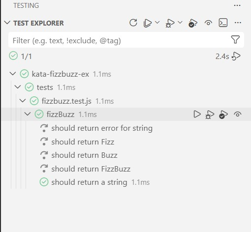

# Kata - FizzBuzz - JS - Vitest

**Escribe un programa que imprima los números del 1 al 100**

- Si el número es divisible por 3, dices **“Fizz”**
- Si es divisible por 5, dices **“Buzz”**
- Si es divisible por 3 y 5, dices **“FizzBuzz”**

## 📋 Escenarios de Aceptación

**Scenario: Número divisible por 3**

> - **Given** que proporciono el número `3`
> - **When** ejecuto la función `FizzBuzz`
> - **Then** el resultado debe ser `"Fizz"`

**Scenario: Número divisible por 5**

> - **Given** que proporciono el número `5`
> - **When** ejecuto la función `FizzBuzz`
> - **Then** el resultado debe ser `"Buzz"`

**Scenario: Número divisible por 3 y 5**

> - **Given** que proporciono el número `15`
> - **When** ejecuto la función `FizzBuzz`
> - **Then** el resultado debe ser `"FizzBuzz"`

**Scenario: Número no divisible ni por 3 ni por 5**

> - **Given** que proporciono el número `7`
> - **When** ejecuto la función `FizzBuzz`
> - **Then** el resultado debe ser `"7"`

**Scenario: El dato proporcionado no es un número**

> - **Given** que proporciono el valor `"hola"`
> - **When** ejecuto la función `FizzBuzz`
> - **Then** debe lanzarse un error indicando que el dato no es un número

## 🛠️ Requisitos

- Realizar un test por cada escenario

**Technologias**

**Estructura del proyecto**

```text
f5-bootcamp-javascript-exercises/
|-- img/
|   `-- kata-fizzbuzz/
|       `-- testing-VS.jpg
|-- src/
|   `-- fizzbuzz/
|       |-- README.md
|       |-- fizzbuzz.js
|       `-- sequence.js
|-- tests/
|   `-- fizzbuzz/
|       |-- fizzbuzz.test.js
|       `-- sequence-output.txt
|-- README.md
|-- package-lock.json
`-- package.json
```

## 📦 Entregables

-[Enlace al repositorio de GitHub](https://github.com/Alexapop/f5-bootcamp-javascript-exercises/tree/main/src/fizzbuzz)
- 
