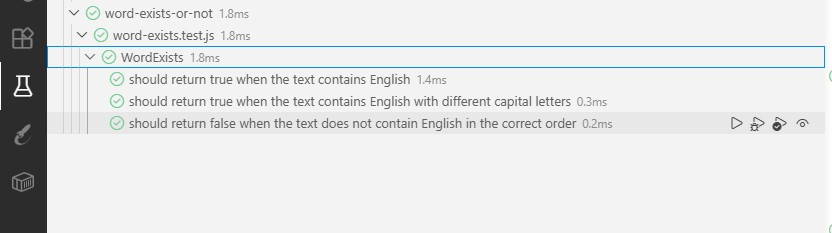

# The word exists or not

Dada una cadena de texto (string) de longitud arbitraria que contiene cualquier carácter ASCII, escribe una función para determinar si dicha cadena contiene la palabra completa "English".

El orden de los caracteres es importante: una cadena como "abcEnglishdef" es correcta, pero "abcnEglishsef" no lo es.

No importa si son mayúsculas o minúsculas: "eNglisH" también se considera correcto (insensible a mayúsculas).

**Valor de retorno:** Devuelve un valor booleano: `true` si la cadena contiene "English" y `false` en caso contrario.

## Tecnología

- **Lenguaje:** JavaScript
- **Framework de Pruebas:** Vitest
- **Entorno de Desarrollo (IDE):** Visual Studio Code

## Algoritmo

1. Comprobar si la función recibe datos.
2. Comprobar si los datos son un string (investigar qué impacto tendrían los caracteres ASCII y cómo controlarlo).
3. Definir nuestro string "English" y el orden exacto de letras.
4. Hacerlo insensible a minúsculas y mayúsculas.
5. Que devuelva el booleano `true` si la cadena encuentra el string "English".
6. Que devuelva el booleano `false` si la cadena **no** encuentra el string "English".
7. Realizar un test.

## Investigación

Después de investigar, decidí que el método adecuado para resolver el ejercicio sería el método `RegExp.prototype.test()`. Este nos ayudará a comprobar si nuestro patrón "English" existe en la cadena de texto y nos devolverá `true` si lo encuentra y `false` en caso contrario.

Para hacerlo "case-insensitive" voy a usar el flag `i`.


*Estructura del proyecto**

```text
f5-bootcamp-javascript-exercises/
|-- img/
|   `-- word-exist.or-not/
|       `-- vitest.jpg
|-- src/
|   `-- word-exist.or-not/
|       |-- README.md
|       |-- word-exists.js
|       `
|-- tests/
|   `-- word-exists-or-not/
|       |-- word-exists.test.js
|       `
|-- README.md
|-- package-lock.json
`-- package.json
```

## Entregables

- [Repositorio de GitHub](https://github.com/Alexapop/f5-bootcamp-javascript-exercises)
- 

